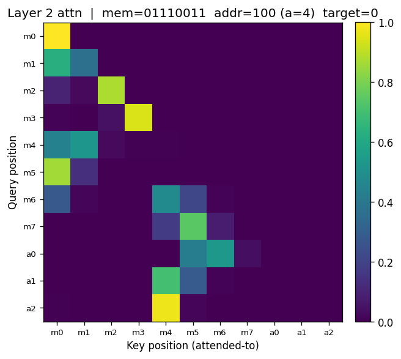
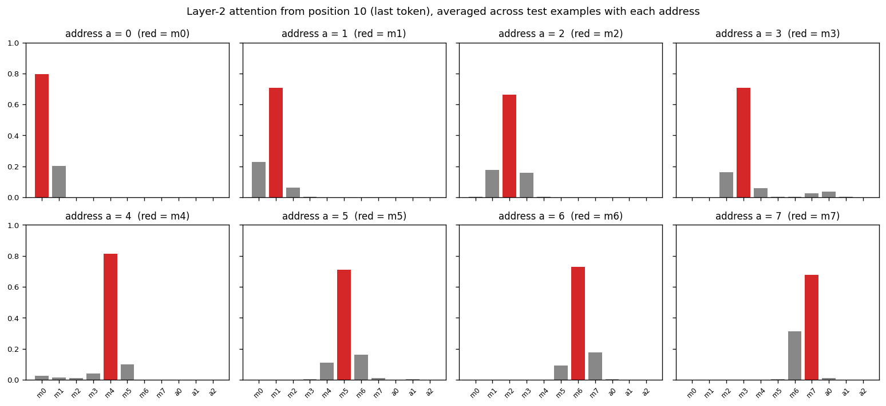
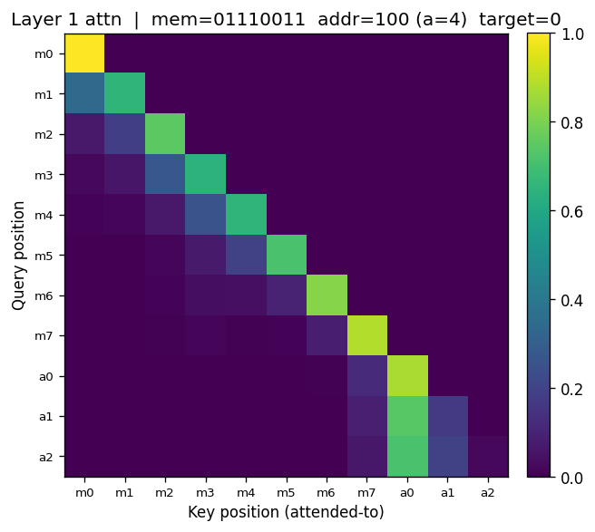
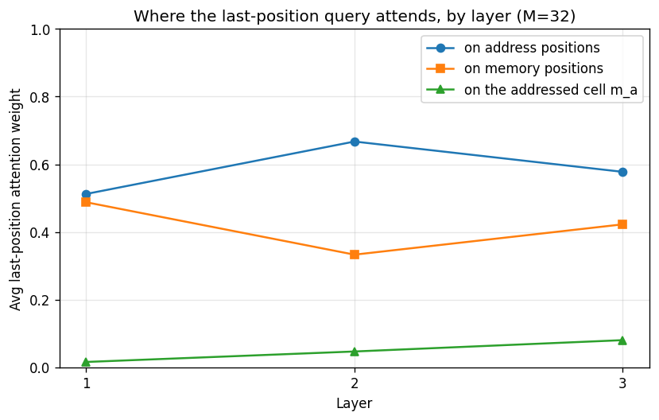
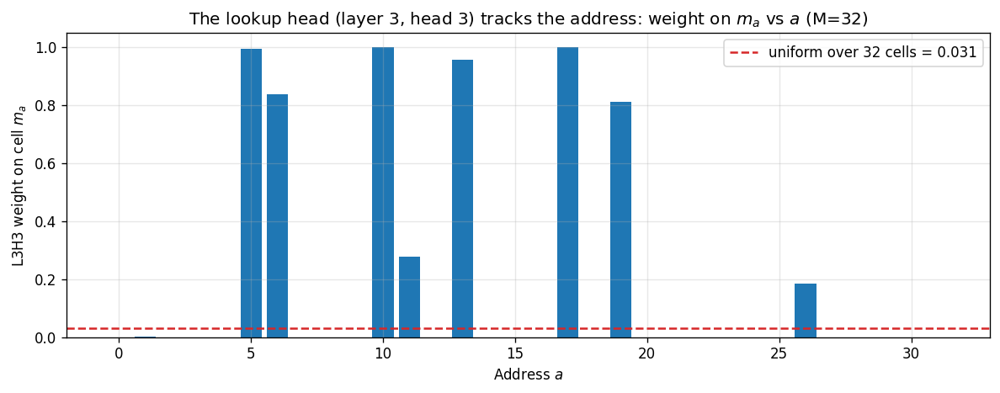
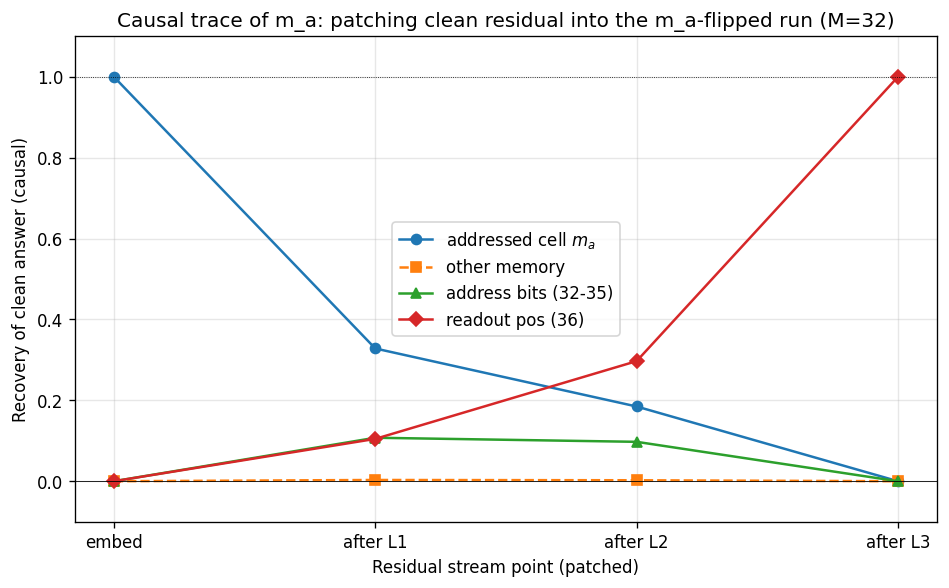

# Reverse-engineering the pointer transformer: the smallest induction-head-adjacent circuit

The previous post built a 2-layer, 1-head transformer that solves the
pointer-dereferencing task at $M = 8$ to 100% test accuracy. We
argued architecturally (§3 of post 6) that the model *must* be
composing two attention lookups: the first layer aggregates the
address bits at position 10, and the second layer uses the assembled
address to attend to the addressed memory bit. That argument was a
prediction. This post checks it.

The model has 17,282 parameters. The task has $2^{11} = 2048$
possible inputs. This is small enough that we can fully describe what
each component does, and we can do it from the trained weights and
activation patterns directly. That is mechanistic interpretability at
its cleanest: a task with a known structure, a model that solves it,
and a hypothesis specific enough to falsify.

The closing question of the post: is this circuit an **induction
head** in the sense of Olsson et al. (2022)? The answer turns out to
be *no, but yes*, and unpacking the distinction is what this post is
ultimately about. It hands us the conceptual frame for **in-context
learning** as a compositional structure built out of content-addressable
lookups.

All code is in [`examples/pointer_interp.py`](https://github.com/queelius/scratchnn/blob/main/examples/pointer_interp.py).

## 1. The setup

A 2-layer, 1-head decoder transformer with $d_{\text{model}} = 32$
and $d_{\text{ff}} = 64$. Trained 2000 iterations with Adam at lr
$= 10^{-3}$, batch size 32, on 20,000 examples of the
$M = 8, A = 3$ pointer task. Test accuracy on 2000 held-out examples:
**1.000**.

Each input is an 11-token sequence (8 memory bits then 3 address
bits, MSB-first). The prediction at position 10 (the last input
position) is the value at memory position $a$, where $a$ is the
integer decoded from the three address bits.

Both layers in the model expose a forward-pass cached attention
matrix `block.attn._attn` of shape $(H, T, T) = (1, 11, 11)$. The
`attention_at(ids, layer, head)` method on `BitTransformer` returns
the $(T, T)$ pattern for any single (layer, head). We use it to
extract patterns per example and across the test set.

## 2. What the circuit must be (restated)

The model produces its prediction by passing the residual stream at
position 10 through the final layer norm and an output head. Anything
the model knows about the answer must be in that residual stream at
position 10 after layer 2.

Before any attention runs, position 10's residual depends on the
embedding of token $a_2$ (the address LSB) plus the positional
encoding for position 10. It does *not* depend on $a_0$ or $a_1$,
which live in positions 8 and 9.

For layer 2's attention at position 10 to attend to memory position
$a = 4 a_0 + 2 a_1 + a_2$, its query at position 10 has to depend on
the full address. The only way that can happen is if layer 1
*already* moved information about $a_0$ and $a_1$ into position 10's
residual. Layer 1 is a self-attention layer, so the only mechanism
available to it is attention from position 10 to positions 8 and 9.

The hypothesis is therefore:

> **Layer 1**: at position 10, attends to positions 8, 9, 10 (the
> address bits) and assembles them into position 10's residual.
>
> **Layer 2**: at position 10, uses the assembled address to attend
> to memory position $a$ and copy its value.

This is the *only* way a 2-layer 1-head transformer can solve the
task. If the trained model is doing something else, the post-6
architectural argument was wrong. If the trained model is doing
exactly this, the architectural argument is empirically vindicated.

## 3. Layer 2 attends to the addressed memory position

For each of four representative test examples with addresses
$a \in \{0, 4, 5, 7\}$, we extract the layer-2 attention pattern.
The relevant row is row 10 (the last query position). Its argmax
(the memory position that receives the highest attention weight):

| Address $a$ | Layer-2 argmax position | Weight on that position |
|---:|---:|---:|
| 0 | 0 | 0.698 |
| 4 | 4 | 0.973 |
| 5 | 5 | 0.881 |
| 7 | 7 | 0.851 |

Every single example sends most of position 10's layer-2 attention
to the memory position whose index matches the address. The figures
make this visible:



The query row corresponds to position 10 (the bottom row). The
attention mass concentrates almost entirely on column 4 (memory
position $m_4$). The same pattern holds for the other addresses.

To rule out cherry-picking, we aggregate across 500 test examples
and average the layer-2 last-row pattern, partitioned by encoded
address:



For every address $a$ from 0 to 7, the average weight on memory
position $m_a$ is 0.66 to 0.81, while the combined average weight on
all other memory positions is only 0.19 to 0.34. The mapping from
address to attended position is clean and consistent across the
test distribution.

| Address $a$ | Avg weight on $m_a$ | Avg weight on other memory |
|---:|---:|---:|
| 0 | 0.795 | 0.205 |
| 1 | 0.706 | 0.294 |
| 2 | 0.661 | 0.339 |
| 3 | 0.708 | 0.252 |
| 4 | 0.812 | 0.188 |
| 5 | 0.710 | 0.286 |
| 6 | 0.729 | 0.269 |
| 7 | 0.676 | 0.315 |

Layer 2 is the dereference, exactly as predicted.

## 4. Layer 1 is the address aggregator

For the same four examples, here is what layer 1 at position 10
attends to (top-three attended positions with weights, and the total
weight on the address positions $\{8, 9, 10\}$ versus the memory
positions $\{0, \ldots, 7\}$):

| Address $a$ | Top-3 (position, weight) | Total on addr | Total on memory |
|---:|---|---:|---:|
| 0 | (8, 0.49), (9, 0.41), (10, 0.05) | 0.956 | 0.044 |
| 4 | (8, 0.71), (9, 0.20), (7, 0.06) | 0.935 | 0.065 |
| 5 | (8, 0.73), (9, 0.19), (10, 0.06) | 0.986 | 0.014 |
| 7 | (8, 0.51), (9, 0.41), (10, 0.04) | 0.965 | 0.035 |

The pattern is unambiguous: layer 1 at position 10 puts
**93% to 99% of its attention mass on the three address positions**.
The memory bits, which dominate the *information content* of the
input by a factor of $8 \div 3$, receive almost no weight.



A subtler observation: the weights within the address positions are
not uniform. Position 8 (the MSB, $a_0$) receives the most weight,
position 9 ($a_1$) less, and position 10 ($a_2$, the LSB) the least.
This is sensible. The MSB partitions the memory into upper and lower
halves; the next bit selects quadrants; the LSB selects within
pairs. A model that has to write the address into a single residual
vector via a linear OV map will weight its inputs by how much they
matter for the downstream lookup, and the MSB matters most for
discriminating memory positions far apart.

The post-6 hypothesis is vindicated: layer 1 *is* gathering the
address. The mechanism is exactly attention-as-content-addressable
lookup, with the position-10 query learning to match the position
embeddings of 8 and 9.

## 5. Causal confirmation: ablations

Correlational evidence is not enough. The fact that layer 1 attends
to address positions and layer 2 attends to the correct memory
position is consistent with the circuit hypothesis but does not by
itself rule out the possibility that the model is mostly using
position-10's embedding plus the bias structure of the data, with
attention along for the ride.

The cleanest causal test is to replace the attention pattern at one
layer with the uniform-on-causal-prefix distribution (each query
position attends with equal weight to every position $\leq$ itself)
and rerun the rest of the forward pass. This removes the layer's
content-addressable behavior while keeping its OV and FFN machinery
intact. If a layer is doing real work, this ablation should hurt
accuracy substantially.

Results on 500 test examples:

| Intervention | Test accuracy |
|---|---:|
| Baseline (no intervention) | **1.000** |
| Layer 1 attention $\to$ uniform | 0.658 |
| Layer 2 attention $\to$ uniform | 0.636 |
| Shuffle the 3 address bits before forward | 0.776 |

Both layer ablations drop accuracy by a third. Either layer is
necessary; neither alone is sufficient; both have to be doing the
hypothesized job.

The shuffle ablation is the most instructive. Permuting the three
address bits leaves the *bit set* unchanged but destroys the
*positional encoding* of which bit is which. If the model depended
only on whether each address bit was 0 or 1 (a permutation-invariant
function of the bits), shuffle would not hurt. The drop from 1.000
to 0.776 confirms that the model is using the bits with their
positional roles, exactly as a circuit doing $a = 4a_0 + 2a_1 + a_2$
would.

Why does shuffle not drop to chance (0.5)? Because the memory bits
are still present, and when many of them happen to agree the
prediction is still correct regardless of which memory position is
addressed. The residual 0.776 is the "guess the majority bit"
baseline given the shuffled address. The 0.224 drop *is* the
attributable contribution of correctly-routed addressing.

## 6. Is this an induction head?

The pattern this circuit implements is **not** the canonical
induction-head pattern, but it is the same *primitive* deployed for
a different purpose. The distinction matters because the induction
head is the textbook small circuit for in-context learning in
transformers, and our circuit is a near-cousin.

The induction head (Olsson et al., 2022, *In-context Learning and
Induction Heads*) is a 2-head, 2-layer circuit that implements the
pattern

$$\ldots \; A \; B \; \ldots \; A \; \to \; B,$$

i.e., on seeing $A$ again, predict whatever followed the previous
occurrence of $A$. The circuit decomposes as:

- **Previous-token head** (layer 1): every position $t$ uses
  attention to copy the embedding of token $t - 1$ into its residual.
  After this, position $t$'s residual encodes the pair "I am here,
  preceded by token $X$."
- **Induction head** (layer 2): at position $t$, query against earlier
  positions using the previous-token-shifted signature to find prior
  occurrences of the same pair. Attend to the position $i$ where
  $\mathrm{token}(i - 1) = \mathrm{token}(t)$. Copy what was at
  position $i$, which is "the thing that followed the last $A$."

The Anthropic transformer-circuits frame (Elhage et al., 2021)
decomposes this into a **QK circuit** (what query-key product is
computed, determining where the attention spike lands) and an **OV
circuit** (what value gets copied once the attention spike is
located). The induction head's QK circuit matches on
previous-token-shifted features; its OV circuit copies the value at
the matched position into the residual stream.

Our pointer circuit fits exactly the same QK/OV frame, just with
different content:

|   | Induction head | Pointer dereference (ours) |
|---|---|---|
| What layer 1 writes into the residual | The previous token's identity, shifted one position | The address bits, gathered from positions 8 and 9 (and 10) into position 10 |
| What layer 2's QK matches on | Previous-token signatures, looking for prior occurrences of the current token | The encoded address, looking for the memory position whose positional encoding matches |
| What layer 2's OV copies | The token value at the matched position | The memory bit at the matched position |
| Domain | Token identities and sequences of them | Positional encodings and an address |

Both are two-layer compositions of content-addressable lookups. The
*mechanism* is identical: attention as soft retrieval, with the
query learning to match the right key. The *content* differs: token
identities for induction heads, positional addresses for ours.

So the answer to "is it an induction head?" is: structurally yes,
literally no. It is what you would call the **address-lookup head**.
It is the same primitive in the same shape, deployed to the *purer*
content-addressable-memory task. Induction heads are the version of
this circuit that the data of natural language asks for; ours is the
version a memory-addressing task asks for.

## 7. ICL is content-addressable lookup, composed

The reason the induction head matters is its connection to
**in-context learning** (ICL): the ability of a trained language
model to use information present in its prompt, without any weight
update, to inform predictions on novel tasks specified in that
prompt.

A small concrete example. Show GPT-3 the prompt:

```
zarp -> bumi
flom -> bumi
trel -> tev
clok -> tev
zarp -> ?
```

It will (often) emit `bumi`. The model has, in context, *learned* a
mapping `zarp -> bumi` from a single example, without any gradient
step. That capability is what makes large language models
qualitatively different from older sequence models, and it is what
the in-context-learning literature is largely about.

Olsson et al.'s argument is that induction heads are a *mechanistic*
substrate for ICL: a circuit that finds prior occurrences of the
current token and copies the next-token value is exactly what is
needed to do one-shot retrieval-from-context. Empirically, the
emergence of induction heads during pretraining coincides with the
emergence of measurable ICL ability.

Our pointer-lookup circuit is in the same family. Read the pointer
task as a one-shot in-context-learning task:

- The **context** is an 8-bit memory and a 3-bit address.
- The **task specification** is implicit: "at this position, retrieve
  memory bit $a$."
- The **completion** is the value at the addressed memory position.

The model has not been trained on the specific 11-bit sequence
appearing at inference time. Most of the $2 \times 10^4$ training
examples never reappear. The model solves each new example by using
the in-context memory and address, exactly as an ICL system would.
It happens to solve it not by token-pattern matching but by
positional-address matching, which is the same primitive used by a
slightly cleaner data-generating process.

This is the broader picture. **In-context learning is what a
transformer does when its content-addressable lookup primitive is
composed over enough tokens, heads, and layers to encode arbitrary
soft retrieval queries.** Induction heads are one well-studied
two-layer instance of that primitive. Our pointer circuit is
another. A trained language model has thousands of attention heads
across dozens of layers, each implementing some specialized lookup,
and ICL is the *emergent* property of running them all together on a
context-dependent task.

What this gives us, looking back at the inductive-bias frame: the
transformer's architectural commitment is not just "attention." It
is specifically "**content-addressable retrieval as a composable
primitive**." The depth axis is *how many composed retrievals* the
model can do. The width axis (multi-head) is *how many parallel
retrievals per layer*. ICL emerges where the depth and width are
large enough that the composed retrievals can encode arbitrary
soft programs over the context.

## 8. What this small model leaves out

Honesty about the scale: the model interpreted here is two layers,
one head, eleven tokens of context, two-token vocabulary. The
circuit is correspondingly minimal. Three things a real
interpretability analysis on a larger model would also cover:

- **OV circuits and embedding geometry**. We have not opened up the
  embedding vectors for tokens 0 and 1 or the sinusoidal positional
  encodings. In a 2-token vocabulary the embedding has only two rows
  to inspect, but the question of how *value information* flows
  through the OV path of each layer is genuinely interesting at
  scale.
- **Multi-head specialization**. Real transformers have many heads
  per layer, each potentially specializing in a different lookup.
  The text-transformer post (`docs/series/archive/transformer-text.md`)
  trains an 8-head model on character-level prose; visualizing its
  per-head attention patterns finds heads that attend to the
  previous space, heads that attend to the start of the current
  word, heads that attend to repeated characters. Each is a small
  specialized lookup; together they enable the rich language-model
  behavior.
- **Activation patching**. The ablations here zero out an attention
  layer entirely. A finer-grained tool is to *patch* an activation
  from one input into another (Wang et al., 2022, *Interpretability
  in the Wild*): copy a residual at one (layer, position) from one run
  into another and see whether the output flips. This isolates the
  *causal* role of each component on each example, and is the basis
  for most published mechanistic interpretability results on language
  models. We use exactly this tool in section 9.4, and it turns out to
  be the difference between seeing the mechanism and not.

The pedagogical point is that the technique we applied here, **state
a circuit hypothesis from the architectural argument and verify it
with attention extraction plus ablation**, is the same technique
used at scale, just with more components and more sophisticated
intervention tools. The next section puts that to the test: it takes
the *same task* at $M = 32$, where post 6 found a third layer is
required, and asks whether the clean circuit survives the scale-up.

## 9. Scaling the lens: attention hides the M=32 circuit, causal tracing reveals it

Everything so far was the $M = 8$ model: 11 tokens, 2 layers, 1 head,
a circuit clean enough to read off the attention maps. Post 6 found
that the same task at $M = 32$ needs a *third* layer (2 layers cannot
solve it at any width or training budget). We have the dissection
tools. Do they reveal the same clean circuit, just scaled up? The
attention maps say no. A causal trace says yes. The gap between those
two answers is the most important lesson in this post.

The model here is an explicit 3-layer transformer (4 heads,
$d_{\text{model}} = 128$, learned PE), written so every attention
matrix is readable, trained to **0.9965** test accuracy on $M = 32$.
Code is in
[`examples/pytorch/pointer_interp_deep.py`](https://github.com/queelius/scratchnn/blob/main/examples/pytorch/pointer_interp_deep.py).

One implementation-realization aside before the mechanism, because it
is the same lesson as post 6 in a new place. The explicit model only
trains if its query/key/value projections use Xavier-uniform
initialization. With PyTorch's default Linear init (Kaiming-uniform,
$a = \sqrt 5$) the projections are mis-scaled, the phase transition is
pushed from iteration ~6000 out past iteration ~22000, and the model
is stuck at 0.62 at a 60000-iteration budget. Right architecture,
right depth, wrong init scale on one set of tensors, and the circuit
never forms. Implementation realization is not a footnote.

### 9.1. Causally, it is a perfect pointer

Start with the question that does not depend on reading any attention
map: does the model compute exactly $m_a$? The test is a causal
intervention. Take a correctly-handled example, flip the bit at the
addressed cell $m_a$, and see whether the prediction follows. Then
flip a bit at a random *non*-addressed cell and see whether the
prediction is disturbed.

| Intervention | Prediction follows? |
|---|---:|
| Flip the addressed cell $m_a$ | tracks the new value **0.995** of the time |
| Flip a random non-addressed cell | prediction changes only **0.005** of the time |

This is airtight. The model reads the addressed cell and nothing
else: flipping $m_a$ flips the answer, flipping any other cell does
nothing. Behaviorally, the 3-layer model is a perfect pointer
dereference, exactly like the $M = 8$ model. Whatever the attention
maps say, the function being computed is the right one.

### 9.2. Mechanically, the clean circuit is gone

Now read the attention. The hope, from the $M = 8$ analysis, is to
find an aggregation layer and a single lookup head spiking on $m_a$.
Here is where the last-position query sends its attention, per layer,
averaged over the test set:



Layers 1 and 2 both attend overwhelmingly to the address positions
(0.51 and 0.67 of their weight), not to memory. So the extra depth
went into a *two-stage* address aggregation: where $M = 8$ assembled
its 3-bit address in one layer, the $M = 32$ model spreads the 5-bit
assembly across layers 1 and 2. The dereference, the weight that
lands on the addressed cell $m_a$, rises across layers (0.016, 0.047,
0.080) and is largest in layer 3. So far, so consistent with "layers
1 and 2 aggregate, layer 3 dereferences."

But look closer at layer 3, head by head. The weight each head puts
on the addressed cell:

| Layer 3 head | h0 | h1 | h2 | h3 |
|---|---:|---:|---:|---:|
| weight on $m_a$ | **0.198** | 0.089 | 0.031 | 0.002 |

Head 0 is the only candidate lookup head, and at 0.198 (versus 0.031
for uniform) it is a weak one. And it does not do a general 1-of-32
lookup. Plotting its weight on $m_a$ as a function of the address:



Head 0 dereferences *cleanly* (weight 0.8 to 1.0) for a sparse
handful of addresses, $a \in \{5, 6, 10, 13, 17, 19\}$, and does
essentially nothing for the other 26. Counting every head in layers 2
and 3, the number of addresses that receive a clean single-head spike
(weight $> 0.5$ on $m_a$) is **10 of 32**. Even summing all four
layer-3 heads into an ensemble, the total weight on $m_a$ exceeds 0.5
for only **8 of 32** addresses (mean 0.29). For the majority of the
address space, the last-position query never visibly concentrates on
the correct memory cell.

The per-layer ablations (replace one layer's attention with uniform,
remeasure accuracy) confirm the load-bearing structure without
identifying a clean lookup:

| Intervention | Accuracy |
|---|---:|
| Baseline | 0.9975 |
| Layer 1 attention $\to$ uniform | 0.540 |
| Layer 2 attention $\to$ uniform | 0.763 |
| Layer 3 attention $\to$ uniform | 0.600 |

Layers 1 and 3 are essential, layer 2 is auxiliary. But "layer 3 is
essential" plus "layer 3 has no clean lookup head for most addresses"
is a genuine puzzle.

### 9.3. Reconciling the two readings

How can the model read exactly $m_a$ (section 9.1) while its
attention barely concentrates on $m_a$ for most addresses (section
9.2)? Two facts dissolve the apparent contradiction.

First, **attention weight is not information flow.** A head's output
is its attention-weighted sum of *value* vectors, and the value
projection can map an attended-to cell to near-zero in the direction
the readout cares about. High attention to a cell does not imply that
cell influences the output, and diffuse attention does not imply the
output is a blur. The causal flip test is the ground truth precisely
because it bypasses this: it perturbs the input and watches the
output, with no assumption that attention weight equals causal
influence.

Second, **multi-head and multi-layer composition spreads the read
out.** Heads concatenate before the output projection, so two heads
each placing 0.3 on $m_a$ combine into a confident read that no
single-head threshold catches. And the dereference can be indirect:
layer 3 can attend to an intermediate position whose residual already
carries $m_a$ because an earlier layer routed it there. Tracing that
path exactly would need activation and path patching (Wang et al.,
2022), heavier machinery than attention-reading.

I will be honest about the arc of this investigation, because it is
how the work actually went. The first hypothesis, written before this
analysis, was that "the third layer is a refinement stage that
sharpens a lookup layer 2 already performs." The data refuted it:
layer 2 does almost no dereferencing (0.047 on $m_a$). The second
hypothesis was that "the lookup heads partition the address space
among themselves." The data refuted that too: all heads together
cleanly cover only 10 of 32 addresses. What survived is narrower and
truer: the model computes $m_a$ exactly (causal test), the depth buys
a two-stage address aggregation (layers 1 and 2), and the dereference
itself is distributed across heads and the value pathway in a way
attention maps do not show. But "attention does not show it" is not
the same as "it cannot be seen." It can. We just need the right tool.

### 9.4. Causal tracing recovers the clean mechanism

The flip test told us $m_a$ is read; it did not tell us *how the value
gets from cell $a$ to the readout at position 36*. Information moves
between positions only through attention, so there must be a path. To
find it, trace the value causally through the residual stream.

The method is activation patching on a minimal pair. For one example,
run the clean input and cache the residual stream after the embedding
and after each block. Run the corrupted input (the same example with
$m_a$ flipped, so the correct answer flips). Then, into the corrupted
run, patch the *clean* residual at one (layer, position) at a time,
and measure how much the readout recovers the clean answer:

$$\text{recovery} = \frac{\Delta_{\text{patched}} - \Delta_{\text{corrupt}}}
                         {\Delta_{\text{clean}} - \Delta_{\text{corrupt}}},
  \quad \Delta = \text{logit}[\text{answer}] - \text{logit}[\text{other}].$$

Recovery near 1 marks a (layer, position) that *carries* $m_a$;
near 0 marks one that does not. Averaging over 100 minimal pairs,
grouped by position class:

| Residual point | addressed cell $m_a$ | other memory | address bits (32-35) | readout (36) |
|---|---:|---:|---:|---:|
| embedding | **1.000** | 0.000 | 0.000 | 0.000 |
| after layer 1 | 0.328 | 0.003 | 0.108 | 0.105 |
| after layer 2 | 0.185 | 0.002 | 0.097 | 0.297 |
| after layer 3 | 0.000 | 0.000 | 0.000 | **1.000** |



Read it top to bottom. At the embedding, the two inputs differ only at
cell $a$, so all the recovery is there (1.000): a sanity check the
method passes exactly. After layer 1, the addressed cell has already
shed most of its exclusivity (0.328) and the value has begun appearing
at the address bits (0.108) and the readout position (0.105). After
layer 2 the readout position is the dominant carrier (0.297) and the
cell continues to drain (0.185). After layer 3 the readout position
holds *all* of it (1.000) and the original cell holds *none* (0.000).

This is a clean, complete mechanism: **$m_a$ is transported from cell
$a$ to the readout position over the three layers**, with the address
bits serving as a partial intermediate conduit, and every other memory
cell carrying nothing at any layer (the flat zero line, consistent
with the flip test). The dereference is not a single hard attention
spike at one layer. It is a gradual, distributed transport, which is
exactly why staring at any one layer's attention row showed only a
fraction of it. The structure was always there; it lived in the
residual-stream flow, not in the attention weights.

So the apparent illegibility of section 9.2 was an artifact of the
tool, not a property of the model. Attention-pattern reading is a weak
instrument once a computation distributes across layers and the value
pathway; causal tracing is the strong one, and it recovers a mechanism
as clean as the $M = 8$ hand analysis, just one the attention maps
could not surface.

### 9.5. Why this is the most useful result in the post

The $M = 8$ model gave a clean circuit you could read straight off the
attention maps. The $M = 32$ model, solving the *same task* with one
more layer, gave a circuit that the attention maps render almost
invisible, and that a causal trace renders perfectly clear. That is
the lesson in one sentence: **the tool, not the model, decides what is
legible.** The single increment in problem size did not make the
mechanism messier in any deep sense (it is still a clean pointer that
transports one bit to the readout); it made the mechanism invisible to
the *weak* instrument while leaving it fully visible to the *strong*
one.

This is why the field leans on causal interventions (activation
patching, path patching, ablation) rather than attention
visualization, and why claims like "head 7 is the lookup head" are
suspect without a causal test behind them. Attention weight is
suggestive, not probative: it is not information flow, and a
computation spread across layers and the value pathway will hide from
it. The induction-head story (section 6) has the same shape at scale:
in real language models induction is distributed across many heads,
ablating any one barely moves the behavior because the others
compensate, and the clean accounts come from causal patching, not from
looking at attention. Our $M = 8 \to M = 32$ transition is that whole
arc in miniature: a legible toy circuit, an apparent loss of legibility
as the task grows, and a causal tool that restores it.

## 10. Closing: the inductive-bias frame, completed

The inductive-bias series identified three axes:

1. **Architecture**: structural priors about how features compose
   (locality, recurrence, content-addressable lookup, ...).
2. **Output head**: priors about the distribution of the response
   (Bernoulli, Categorical, Gaussian, Poisson, ...).
3. **Implementation realization**: whether the gradient procedure
   can actually discover the right parameters given init, optimizer,
   data, and schedule.

This post is the **interpretability axis** that sits across all
three. Once a model is trained, mechanistic interpretation tells us
*which* of the bias-permitted solutions the gradient procedure
actually picked, and how legibly. At $M = 8$ the answer was a single,
clean, fully readable circuit. At $M = 32$, one increment of scale
later, the answer was a causally perfect pointer whose mechanism the
attention maps render only partially legible. That progression is the
real shape of the field: legible circuits in the smallest models,
partial legibility as scale grows, and causal probes rather than
weight-reading as the reliable ground truth. Interpretability is how
we discover which solution was picked, and the $M = 8 \to M = 32$ step
is a warning about how quickly "which" gets hard to answer.

The next (and closing) post is on **reinforcement learning**, where
the supervised label is replaced by a scalar reward signal over
trajectories. The inductive-bias frame extends; the interpretability
frame extends; the mechanism we just dissected becomes one tool
among several for understanding what a learned agent has actually
learned.
